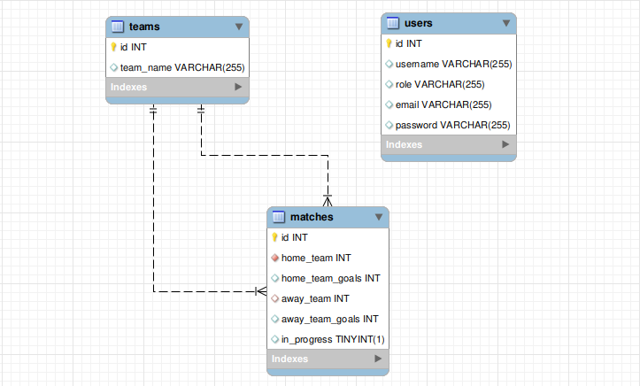
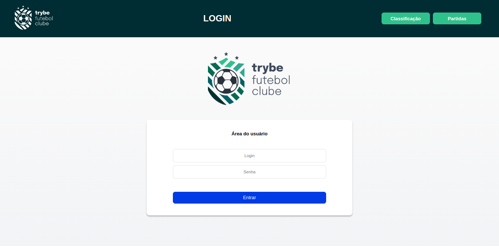
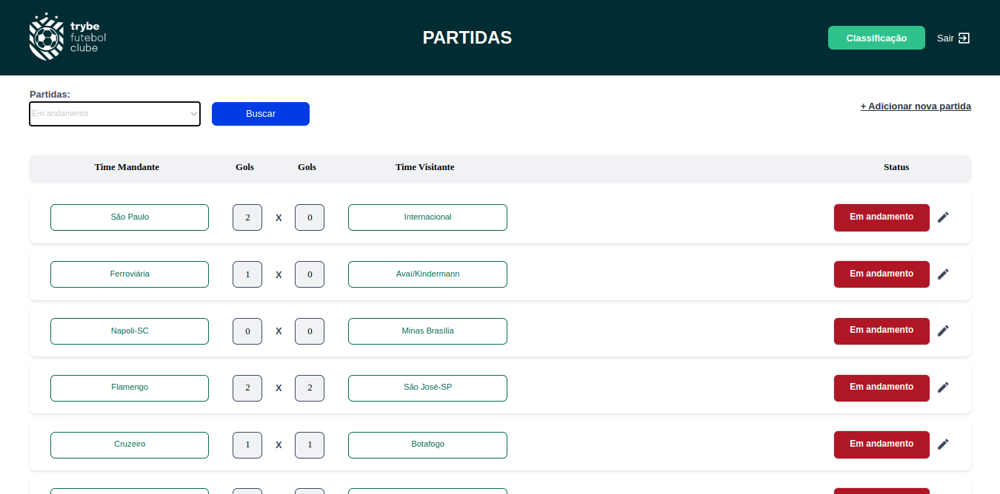
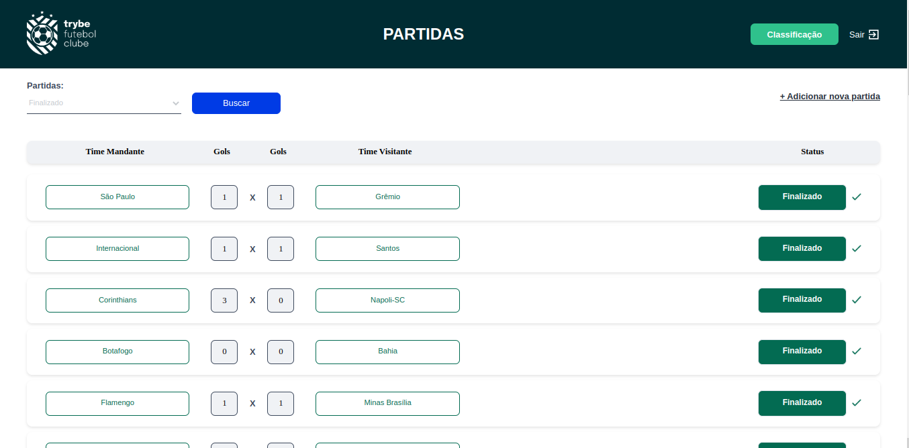
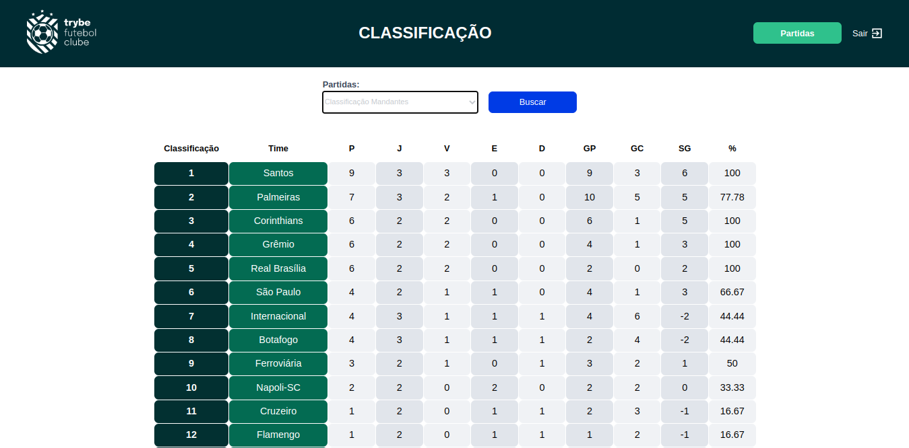

Este projeto contém os requisitos realizados por _[Anna Beatriz Garcia Trajano de Sá](www.linkedin.com/in/anna-beatriz-trajano-de-sá)_ enquanto estudava na [Trybe](https://www.betrybe.com/) :rocket:

# Project Trybe Futebol Clube

O TFC é um site informativo sobre partidas e classificações de futebol!

Nesse projeto, desenvolvi um back-end dockerizado utilizando modelagem de dados através do Sequelize. 

O desenvolvimento respeitou as regras de negócio providas no projeto e a API contruída foi capaz de consumir um front-end estruturado anteriormente.

Para adicionar uma partida é necessário ter um token, portanto a pessoa deverá estar logada para fazer as alterações. 

Existe um relacionamento entre as tabelas teams e matches para fazer as atualizações das partidas. O diagrama relacional pode ser 
visualizado a seguir.

## Banco de Dados e Layout 

 Diagrama de Entidade-Relacionamento - TFC        
:-------------------------:|
  |

Login Page        
:-------------------------:|
  |

Matches Page            |  Matches Page    
:-------------------------:|:-------------------------:
  |  

Leaderboard Page        
:-------------------------:|
  |

---

## Demo


---

## Instalação do projeto localmente:
 
Após cada um dos passos, haverá um exemplo do comando a ser digitado para fazer o que está sendo pedido, caso tenha dificuldades e o exemplo não seja suficiente, não hesite em me contatar em _annagarcia@id.uff.br_ 

1. Abra o terminal e crie um diretório no local de sua preferência com o comando **mkdir**:
```javascript
  mkdir projetos
```

2. Entre no diretório que acabou de criar e depois clone o projeto:
```javascript
  cd projetos
  git clone git@github.com:annabia95/project-trybe-futebol-clube.git
```

3. Acesse o diretório do projeto e depois utilize o comando **npm i** para instalar todas as dependências necessárias:
```javascript
  cd project-trybe-futebol-clube
  npm i
```

- ✨ **Dica:** Caso queira utilizar _Docker_ para rodar os testes localmente e validar as funcionalidades, basta seguir as seguintes instruções:

 **:warning: Antes de começar, seu docker-compose precisa estar na versão 1.29 ou superior. [Veja aqui](https://www.digitalocean.com/community/tutorials/how-to-install-and-use-docker-compose-on-ubuntu-20-04-pt) ou [na documentação](https://docs.docker.com/compose/install/) como instalá-lo. No primeiro artigo, você pode substituir onde está com `1.26.0` por `1.29.2`.**

  > :information_source: Rode os serviços `node` e `db` com o comando `docker-compose up -d`.
  - Lembre-se de parar o `mysql` se estiver usando localmente na porta padrão (`3306`), ou adapte, caso queria fazer uso da aplicação em containers;
  - Esses serviços irão inicializar os containers do banco de dados (MySQL), do backend e frontend.
  
  > :information_source: Instale as dependências [**Caso existam**] com `npm install`

  - **:warning: Atenção:** Caso opte por utilizar o Docker, **TODOS** os comandos disponíveis no `package.json` (npm start, npm test, npm run dev, ...) devem ser executados **DENTRO** do container, ou seja, no terminal que aparece após a execução do comando `docker exec` citado acima. 

  - **:warning: Atenção:** O **git** dentro do container não vem configurado com suas credenciais. Ou faça os commits fora do container, ou configure as suas credenciais do git dentro do container.

  - **:warning: Atenção:** Não rode o comando npm audit fix! Ele atualiza várias dependências do projeto, e essa atualização gera conflitos com o avaliador.


## Habilidades Desenvolvidas

Neste projeto, desenvolvi as seguintes habilidades:

 - Realizar a dockerização dos apps, network, volume e compose;
 - Modelar dados com MySQL através do Sequelize;
 - Criar e associar tabelas usando models do sequelize;
 - Construir uma API REST com endpoints para consumir os models criados;
 - Construir um CRUD com TypeScript, utilizando ORM.

 
 ## Referências
 [Documentação Oficial - TypeScript](https://www.typescriptlang.org/docs/)<br>
 [Documentação Oficial - Express](https://expressjs.com/pt-br/4x/api.html)<br>
 [Documentação Express - Rotas](https://expressjs.com/pt-br/guide/routing.html)<br>
 [Chai Assertion Library](https://www.chaijs.com/api/bdd/)<br>
 [Stubs - Sinon.JS](https://sinonjs.org/releases/v14/stubs/)<br>
 [JWT](https://jwt.io/)<br>
 [Conventional Commits](https://gist.github.com/qoomon/5dfcdf8eec66a051ecd85625518cfd13)<br>

 ## Escopo do Projeto
 
 # Seção 1: Users e Login

### 1 - Desenvolva em /app/backend/src/database nas pastas correspondentes, uma migration e um model para a tabela users

### 2 - (TDD) Desenvolva testes que cubram no mínimo 5% dos arquivos back-end em /src, com um mínimo de 7 linhas cobertas

### 3 - Desenvolva o endpoint /login no back-end de maneira que ele permita o acesso com dados válidos no front-end

### 4 - (TDD) Desenvolva testes que cubram no mínimo 10% dos arquivos back-end em /src, com um mínimo de 19 linhas cobertas

### 5 - Desenvolva o endpoint /login no back-end de maneira que ele não permita o acesso sem informar um email no front-end

### 6 - (TDD) Desenvolva testes que cubram no mínimo 15% dos arquivos back-end em /src, com um mínimo de 25 linhas cobertas

### 7 - Desenvolva o endpoint /login no back-end de maneira que ele não permita o acesso sem informar uma senha no front-end

### 8 - (TDD) Desenvolva testes que cubram no mínimo 20% dos arquivos back-end em /src, com um mínimo de 35 linhas cobertas

### 9 - Desenvolva o endpoint /login no back-end de maneira que ele não permita o acesso com um email inválido no front-end

### 10 - (TDD) Desenvolva testes que cubram no mínimo 30% dos arquivos back-end em /src, com um mínimo de 45 linhas cobertas

### 11 - Desenvolva o endpoint /login no back-end de maneira que ele não permita o acesso com uma senha inválida no front-end

### 12 - Desenvolva o endpoint /login/validate no back-end de maneira que ele retorne os dados corretamente no front-end

# Seção 2: Times

### 13 - (TDD) Desenvolva testes que cubram no mínimo 45% dos arquivos back-end em /src, com um mínimo de 70 linhas cobertas

### 14 - Desenvolva em /app/backend/src/database nas pastas correspondentes, uma migration e um model para a tabela de teams

### 15 - Desenvolva o endpoint /teams no back-end de forma que ele possa retornar todos os times corretamentes

### 16 - (Desenvolva o endpoint /teams/:id no back-end de forma que ele possa retornar dados de um time específico

### 17 - (TDD) Desenvolva testes que cubram no mínimo 60% dos arquivos back-end em /src, com um mínimo de 80 linhas cobertas

# Seção 3: Partidas

### 18 - Desenvolva em /app/backend/src/database nas pastas correspondentes, uma migration e um model para a tabela de matches

### 19 - Desenvolva o endpoint /matches de forma que os dados apareçam corretamente na tela de partidas no front-end.

### 20 - Desenvolva o endpoint /matches de forma que seja possível filtrar as partidas em andamento na tela de partidas do front-end

### 21 - Desenvolva o endpoint /matches de forma que seja possível filtrar as partidas finalizadas na tela de partidas do front-end

### 22 - (Bônus; TDD) Desenvolva testes que cubram no mínimo 80% dos arquivos back-end em /src, com um mínimo de 100 linhas cobertas

### 23 - Desenvolva o endpoint /matches de modo que seja possível salvar uma partida com o status de inProgress como true no banco de dados

### 24 - Desenvolva o endpoint /matches/:id/finish de modo que seja possível alterar o status inProgress de uma partida para false no banco de dados

### 25 - Desenvolva o endpoint /matches de forma que não seja possível inserir uma partida com times iguais

### 26 - Desenvolva o endpoint /matches de forma que não seja possível inserir uma partida com um time que não existe na tabela teams

### 27 - Desenvolva o endpoint /matches de forma que não seja possível inserir uma partida sem um token válido

### 28 - Desenvolva o endpoint /matches/:id de forma que seja possível atualizar partidas em andamento

# Seção 4: Leaderboards (placares)

### 29 - Desenvolva o endpoint /leaderboard/home de forma que seja possível filtrar as classificações dos times da casa na tela de classificação do front-end com os dados iniciais do banco de dados

### 30 - Desenvolva o endpoint /leaderboard/home de forma que seja possível filtrar as classificações dos times da casa na tela de classificação do front-end, e atualizar a tabela ao inserir a partida Corinthians 2 X 1 Internacional

### 31 - Desenvolva o endpoint /leaderboard/away, de forma que seja possível filtrar as classificações dos times quando visitantes na tela de classificação do front-end, com os dados iniciais do banco de dados

### 32 - Desenvolva o endpoint /leaderboard/away de forma que seja possível filtrar as classificações dos times quando visitantes na tela de classificação do front-end e atualizar a tabela ao inserir a partida Corinthians 2 X 1 Internacional
